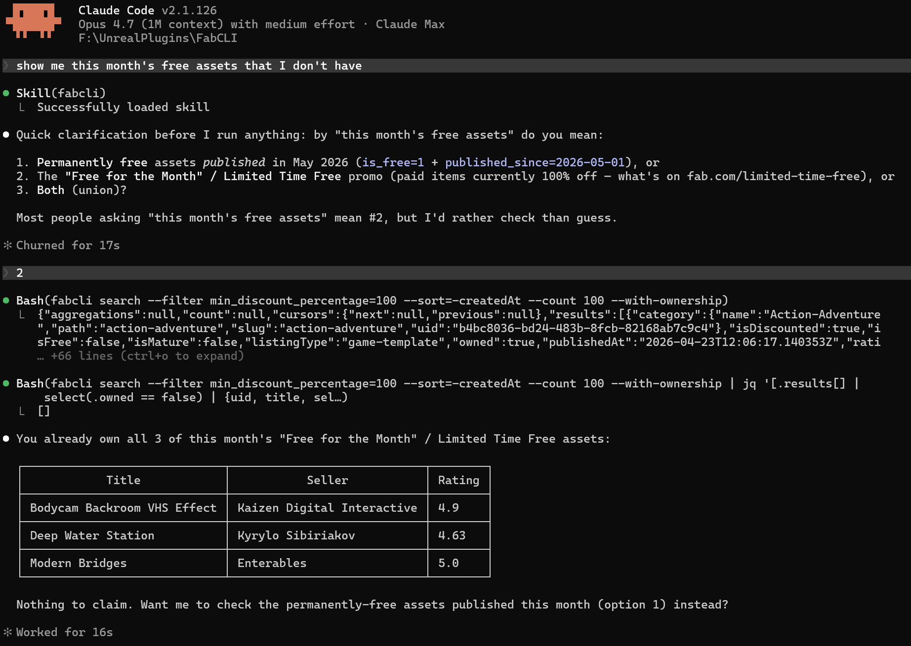

# FabCLI

Command-line tool for the Epic Games Store and Fab marketplace,
designed to be driven by AI coding agents (Claude Code, Cursor,
Codex CLI, Gemini CLI) — and usable by humans directly too.



[](https://buymeacoffee.com/zirklerite)

If FabCLI saves you time, you can [buy me a coffee](https://buymeacoffee.com/zirklerite).

## Installation

### Download

Grab the latest release archive from the
[GitHub Releases](https://github.com/zirklerite/FabCLI/releases)
page:

- Windows: `fabcli-v<version>-windows64.zip`
- Linux:   `fabcli-v<version>-linux64.tar.gz`

Extract it. Inside is a single `fabcli` (or `fabcli.exe`) binary
plus this README — no installer to run.

### Add to PATH

Put the binary on your PATH so you can run it from any directory.

#### Windows

Copy `fabcli.exe` somewhere you control (e.g. `C:\Tools\fabcli\`),
then add that folder to PATH:

1. Press `Win` and open **Edit environment variables for your
   account** (or **Edit the system environment variables** for an
   all-users install — needs admin).
2. Select `Path` → **Edit** → **New** → paste the folder path →
   **OK**.
3. Open a new terminal and run `fabcli --version`.

#### Linux (Ubuntu 24.04 LTS)

```bash
sudo apt install libgtk-3-0 libwebkit2gtk-4.1-0 libsoup-3.0-0
chmod +x fabcli
mv fabcli ~/.local/bin/        # or: sudo mv fabcli /usr/local/bin/
fabcli --version
```

`~/.local/bin` is on PATH by default on Ubuntu. If it isn't, add
`export PATH="$HOME/.local/bin:$PATH"` to `~/.profile` and open a
new shell. Other distros may work with equivalent GTK 3 /
WebKit2GTK 4.1 / libsoup 3 packages but are unverified.

### Updating

Once FabCLI is on PATH, future upgrades don't need the
download/extract/PATH dance — just run:

```
fabcli update           # download latest release, swap binary in place
fabcli update --check   # report running vs latest, no download
```

## Agent integration (optional)

FabCLI works as a plain CLI from any shell. To teach an AI coding
agent how to drive it:

- **Claude Code:** `fabcli skill install` — writes the bundled
  skill to `~/.claude/skills/fabcli/SKILL.md` (Linux) or
  `%USERPROFILE%\.claude\skills\fabcli\SKILL.md` (Windows).
- **Cursor, Codex CLI, Gemini CLI, Aider, others:** copy the
  skill content into the agent's instruction file
  (`.cursorrules`, `AGENTS.md`, `GEMINI.md`, `.aider.conf.yml`).
  Run `fabcli skill path` to locate the source.

See [`FAQ.md`](FAQ.md) → *"Can I use FabCLI with Cursor / Codex
CLI / Gemini CLI / Aider / etc.?"* for per-agent recipes.

## Quick Start

### Sign in

```bash
# Interactive login (opens a browser window, auto-captures the code).
# Re-login about every 90 days when prompted.
fabcli auth login
fabcli auth status                    # check session (headless)
fabcli auth whoami                    # print account info
```

### Browse and search

```bash
fabcli search -q "medieval kitbash" --filter channels=unreal-engine
fabcli search --filter is_free=1                              # permanently free assets
fabcli search --filter min_discount_percentage=100            # Limited Time Free / "Free for the Month"
fabcli search -q "lamp" --with-ownership                      # decorate results with owned: true/false
fabcli library                                                # list owned assets (~100s on a 1k-item library; set FABCLI_LIBRARY_CACHE=1 to cache so repeats finish in ~10ms)
fabcli listing <uid>                                          # full detail for one asset
```

### Claim and download

```bash
fabcli claim <uid>                                            # add a free asset to library
fabcli claim-batch --uids uid1,uid2,uid3                      # batch claim
fabcli download <uid> -o ./my-asset/                          # download by UID (recommended)
fabcli download <uid> -o ./my-asset/ --engine UE_5.4          # disambiguate multi-version
fabcli download --artifact-id X --namespace Y --asset-id Z -o ./my-asset/  # explicit IDs (legacy)
```

See [`FAQ.md`](FAQ.md) for the full command reference, including
filters, batch modes, library caching, multi-account workflows, and
exit-code meanings.

## Output Format

All commands emit compact JSON to stdout. Add `--pretty` for
human-readable output. Errors go to stderr as:

```json
{"error":{"kind":"...","message":"..."}}
```

Exit codes: 0 = success, 1 = generic, 2 = auth required, 3 = not found,
4 = rate limited, 5 = network, 6 = invalid args.

## Token Storage

Session tokens are stored at:

- **Windows:** `%APPDATA%\fabcli\token.json`
- **Linux:** `~/.config/fabcli/token.json`

The file is encrypted at rest using your OS user keystore (DPAPI
on Windows, libsecret on Linux). Set `FABCLI_TOKEN_PATH` to
override the location. See [`FAQ.md`](FAQ.md) → "Token storage"
for the full security model and the zero-on-disk recipe.

## Disclaimer

FabCLI is an **unofficial, third-party** tool, not affiliated with
or endorsed by Epic Games or Fab. Use is subject to Epic's and
Fab's Terms of Service, and you are responsible for your account,
your machine, your purchases, and compliance. Provided **as is**
under GPL v3.0 with no warranty.

**Upstream APIs are undocumented and unversioned.** Epic and Fab
can change endpoints, response shapes, or auth flows at any time,
and individual commands may break without notice. Pin a known-good
version for production automation and watch
[Releases](https://github.com/zirklerite/FabCLI/releases) for
compatibility patches.

**Account-suspension risk.** Driving these undocumented endpoints
may breach Epic's / Fab's Terms of Service and lead to account
suspension or other action against your account. By using FabCLI
you accept that risk; the project authors disclaim all liability
for account actions taken against you. Keep usage modest — prefer
the cache, avoid parallel fan-out, and don't share an account
between multiple automation drivers.

Read [`FAQ.md`](FAQ.md) → *"Disclaimer & user responsibility"*
before using FabCLI in any automated or production workflow.

## More Information

- [`FAQ.md`](FAQ.md) — auth model, command reference, exit codes,
  environment variables, safety, and disclaimer.
- https://github.com/zirklerite/FabCLI — source, issues, releases.
- https://github.com/zirklerite/fabcli-skills — Claude Code
  skill marketplace plugin (mirrors the binary's bundled skill).
- https://github.com/achetagames/egs-api-rs — upstream Epic API
  Rust library FabCLI builds on (we ship a maintenance fork at
  `zirklerite/egs-api-rs`).

## License

[GNU GPL v3.0 or later](LICENSE) — FabCLI is free software. You can
redistribute and modify it under the terms of the GPL. Any binary
you distribute must be accompanied by (or offer access to) the
corresponding source. Third-party dependency notices ship in
`THIRD-PARTY-LICENSES.html` inside each release archive.
